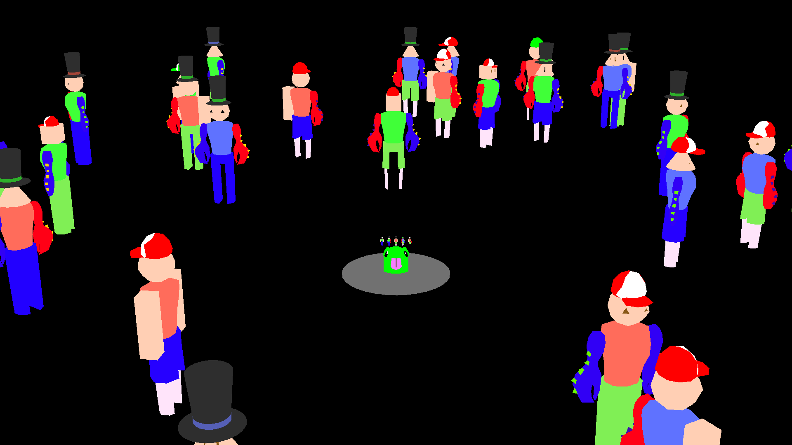

# Alien Hitman

### Author: Matthew Largo

### Where's Waldo, but you are an alien assassain who must find their targets in an ever-growing crowd to fulfill your quota.

Screen Shot:

## How To Play:

### Controls:

WASD - Move relative to the direction the camera is facing.

Mouse motion - Rotate the camera around the player.

Scroll wheel - Zooms the camera towards (scroll down) and away (scroll up) from the player.

Q - Quit the game.

R - Restart the game.

SPACE - Continue to the next quota.

Escape - Ungrab the mouse.

### Objective:

Fulfill your elimination quota by colliding with the indiviudals who match the features from the hit list you have been provided---make even one mistake, and you will lose your status aas a hitman! You can view your hit list by zooming all the way in and looking at a downward angle. Zoom all the way out to get a better view of your surroundings and to reorient yourself. WASD moves you relative to direction the camera is facing.

If you fulfill the current quota, you can take on another by pressing SPACE. Eliminate as many targets as you can and make ZERO mistakes!

This game was built with [NEST](NEST.md).
